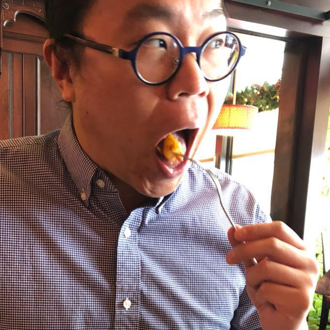

---
---

<link rel="stylesheet" href="styles.css" type="text/css">

I like to analyze data and to plan experiments to discover new things about cancer. Currently, I am an Associate Professor of Oncology at [Roswell Park Comprehensive Cancer Center](https://www.roswellpark.org) in the Department of Biostatistics and Bioinformatics. 

My full CV is available [here](files/engcv-2018-0326.pdf).