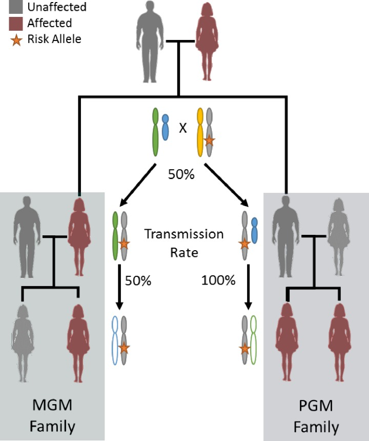

---
---
<article>
<h1>Genetics</h1>
Paternal lineage early onset hereditary ovarian cancers: a Familial Ovarian Cancer Registry study.  PLoS Genetics. 2018 [PMID:29447163](https://www.ncbi.nlm.nih.gov/pmc/articles/PMC5813894/).

</article>

<article>
<h1>Biomarker Statistics</h1>
•	Eng KH, Seagle BL.  Covariate-adjusted restricted mean survival times and curves.  J Clin Oncol. 2017 Feb;35(4):465-466. PMID: 28129530.
•	Eng KH, Schiller E, Morrell K. On representing the prognostic value of continuous gene expression biomarkers.  Oncotarget. 2015.  6(34):36308-18. PMID:26486086.
•	Eng KH.  Randomized reverse marker strategy design for prospective biomarker validation. Statistics in Medicine.  2014. 33(18): 3089-99. PMID: 24639051.
•	Eng KH, Hanlon BH.  Discrete mixture modeling to address genetic heterogeneity in time-to-event regression.  Bioinformatics.  2014. 30(12):1690-1679. PMID: 24532723.
•	Eng KH, Wang S, Bradley WH, Rader JS, Kendziorski C.  Pathway-index models for construction of patient-specific risk profiles.  Statistics in Medicine. 2013. 32(9), 1524-1535.  PMID:23074142.
</article>

<article>
<h1>Defining outcomes for medical oncology</h1>
•	Eng KH, Hanlon BM, Bradley WH, Szender JB.  Prognostic factors modifying the treatment-free interval in recurrent ovarian cancer.  Gynecologic Oncology. 2015. 139(2): 228-35. PMID:26383827.
</article>

•	Eng KH, Corrada Bravo H, Keles S.  Phylogenetic Mixture Model for the Evolution of Gene Expression Families. Molecular Biology and Evolution. 2009. 26(10):2363-2372. PMID: 19602540. •	Corrada Bravo H, Wright S, Eng KH, Keles S, Wahba G. Estimating Tree Structured Covariance Matrices via Mixed-Integer Programming. Journal of Machine Learning Research. 2009. 5:41-48. PMID: 22081761.

•	Ruggeri C, Eng KH. Inferring active and prognostic ligand-receptor pairs with interactions in survival regression models.  Cancer Informatics. 2015. 13(S7): 67-75. PMID:25657571.
•	Eng KH, Tsuji T. Immunoreactive subset of advanced ovarian cancers is associated with prognosis and differential antigen expression. PLoS One. 2014. 9(11):e111586.  PMID:24380171.
•	Eng KH, Ruggeri C. Connecting prognostic ligand receptor signaling loops in advanced ovarian cancer. PLoS One. 2014.  9(9): e107193. PMID:25244152.
•	Eng KH, Weir I, Tsuji T, Odunsi K.  Immuno-stimulatory/regulatory gene expression patterns in advanced ovarian cancer.  Genes & Cancer. 2015. 6(9-10): 399-407. PMID: 26622942.
